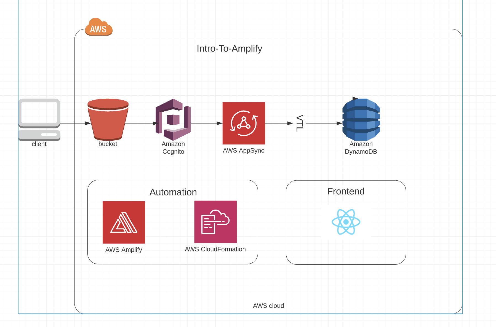

# Serverless-Series

## Intro-To-Amplify

- Live-Stream: https://youtu.be/94Jl40Q5dAQ

- Meetup: https://www.meetup.com/AWSMeetupGroup/events/269767844/

### PreReqs

1. Create AWS Account: https://aws.amazon.com/resources/create-account/

2. Install and configure Amplify CLI https://aws-amplify.github.io/docs/cli-toolchain/quickstart

   - YouTube walk through: https://youtu.be/fWbM5DLh25U

3. Clone repo: `git clone https://github.com/austinloveless/serverless-series`

### Amplify Docs

- https://aws-amplify.github.io/docs/

### Diagram

## To run this app:

1. Clone the repository

- `git clone https://github.com/austinloveless/serverless-series`

2. Change into the directory

- `cd graphql`

3. Install the dependencies

- `npm install`

4. Deploy the amplify project

- `amplify init`

- `amplify push`

5. Start the app

- `npm start`
